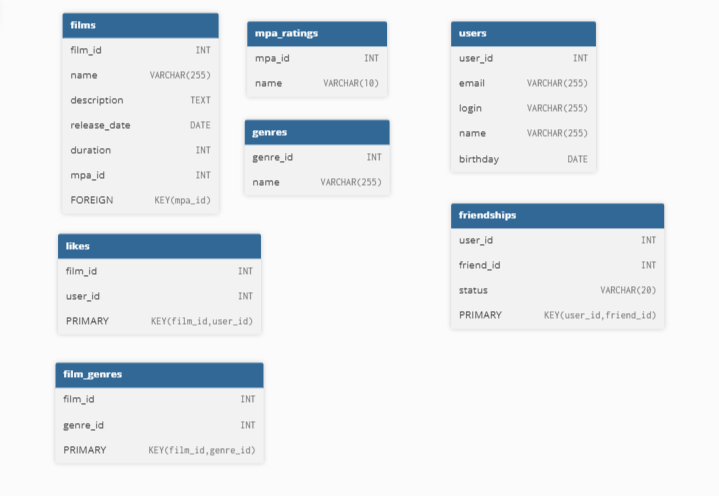

# java-filmorate
Template repository for Filmorate project.

# Запросы 
## 1. Получить все фильмы, выпущенные после определенной даты

SELECT *
FROM films
WHERE release_date > '2023-01-01'; 

## 2. Найти фильмы определенного жанра

SELECT f.*
FROM films f
JOIN film_genres fg ON f.id = fg.film_id
JOIN genres g ON fg.genre_id = g.id
WHERE g.name = 'Комедия'; 

## 3. Получить список друзей определенного пользователя

SELECT u.*
FROM users u
JOIN friends f ON u.id = f.friend_id
WHERE f.user_id = 123 AND f.status = 'подтверждена'; -- Замените 123 на ID пользователя

## 4. Найти пользователей, которые лайкнули определенный фильм

SELECT u.*
FROM users u
JOIN likes l ON u.id = l.user_id
WHERE l.film_id = 456; 

## 5. Получить количество лайков для каждого фильма

SELECT f.name, COUNT(l.user_id) AS like_count
FROM films f
LEFT JOIN likes l ON f.id = l.film_id
GROUP BY f.name
ORDER BY like_count DESC;